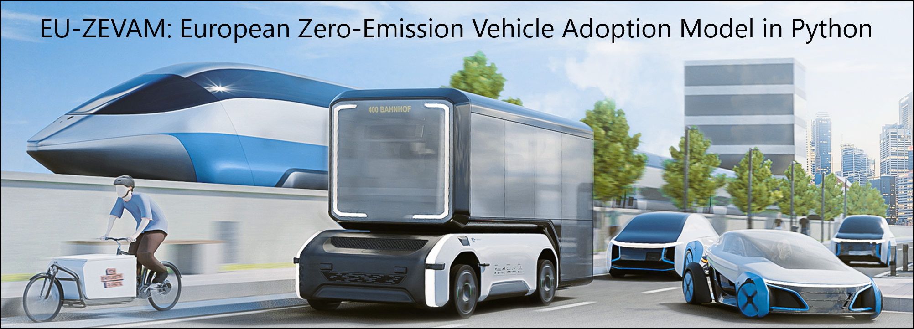
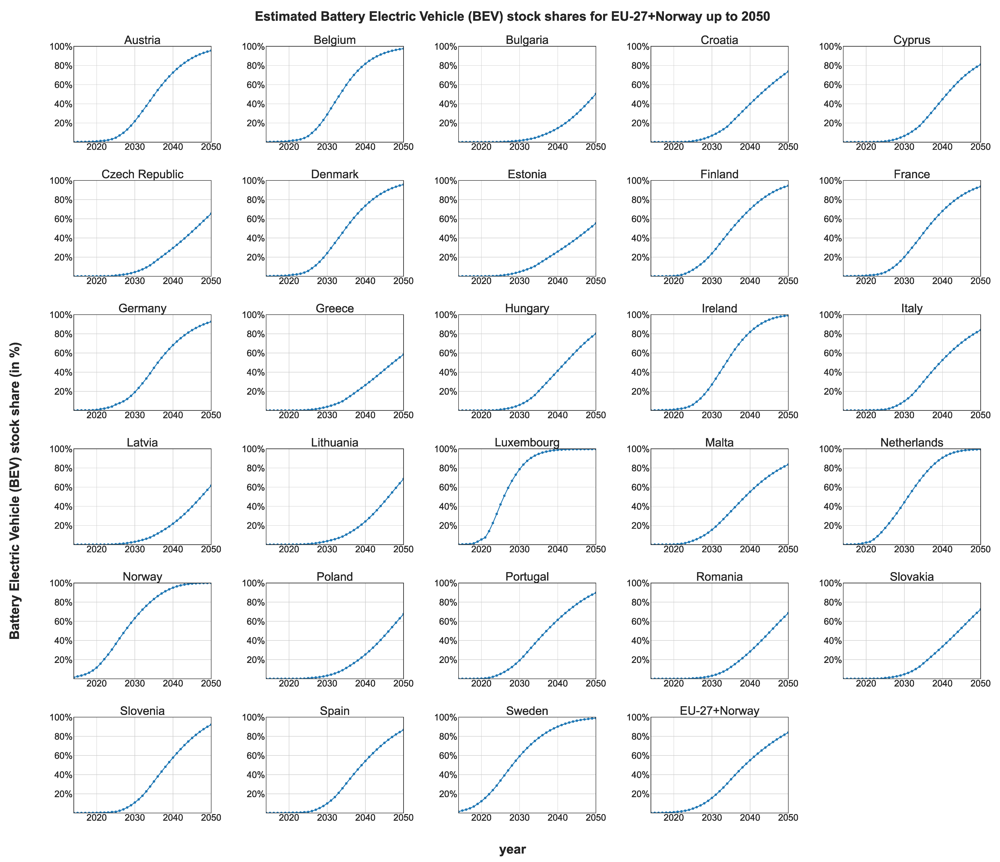

<!--
SPDX-FileCopyrightText: 2025 German Aerospace Center, Gabriel Möring-Martínez

SPDX-License-Identifier: CC-BY-4.0
-->



[](https://api.reuse.software/info/github.com/gabrielmoringmartinez/European-passenger-car-stock-model)
[](LICENSES/MIT.txt)
[](LICENSES/CC-BY-SA-4.0.txt)
[](https://github.com/gabrielmoringmartinez/European-passenger-car-stock-model/actions/workflows/test.yml)
[](https://codecov.io/github/gabrielmoringmartinez/European-passenger-car-stock-model)


<a href="https://github.com/gabrielmoringmartinez/European-passenger-car-stock-model">
  
</a>

# 🚗 EU-ZEVAM: European Zero-Emission Vehicle Adoption Model in Python
**Integrating transport simulation and fleet survival analysis to forecast Europe’s electric vehicle transition**


The model allows to project the future European passenger car fleet composition by powertrain up to 2050.

## Table of Contents
- [About](#-about)
- [Statement of need](#-statement-of-need)
- [Recommended skills](#-recommended-skills)
- [Installation](#-installation)
- [Testing](#-testing)
- [Acknowledgements](#-acknowledgements)
- [Authorship](#-authorship)
- [Citation](#-citation)
- [License](#-license)
- [Contacts](#%EF%B8%8F-contacts)
- [How to Build](#-how-to-build)
- [Documentation](#-documentation)
- [Feedback and Contributions](#-feedback-and-contributions)

## 🔋 About

This repository presents a European passenger car stock model. It is based on the EU clustering model presented in [(Möring-Martínez et al., 2024)](https://doi.org/10.1016/j.trd.2024.104372) and in the empirical survivality rates approach presented in [(Held et al., 2021)](https://doi.org/10.1186/s12544-020-00464-0). This code is used to analyze the European BEV stock fleet up to 2050 in the publication: (Möring-Martínez et al., 2025 - under review).

<div align="center">
  
  <p style="margin-top: 0;"><b>Figure 1:</b> Estimated BEV stock shares for EU-27+Norway up to 2050 using [(Möring-Martínez et al., 2024)](https://doi.org/10.1016/j.trd.2024.104372) and 2021 country-specific empirical survival rates .</p>
</div>

## 📜 Statement of need

The European Passenger Car Stock Model is a model designed to project the composition of the passenger car fleet by powertrain type up to the year 2050 or later if desired, using the projection of new vehicle registrations and empirical survival rates as inputs. Built on country-specific data from 2021, the model enables researchers and policymakers to project future fleet compositions under varying new vehicle registration scenarios and/or varying empirical survival rates.

**Core features**

- **Scenario Exploration:**
Users can provide as input different new vehicle registration secenarios or modify the survival rates. Different new vehicle registration scenarios can have:
  - Technology advancements
  - Current and progressive policy implementations
  - Changes in energy prices

  Different survival rates can define:
  - Restrictions on vehicle drivability after a certain age based on survival rates.
  - Dynamic survival rates analyzing the effect of slower or faster stock turnover rates.

- **Survival Rate Analysis:**
The model incorporates historical survival rates from 2008, 2016, and 2021, allowing for detailed exploration of how changing lifespans influence fleet dynamics. Alternatively, assumptions about using other countries' survival rates can be used also to assess the impact.

**Contribution to the state of the art**

Unlike most existing tools in the field, which are proprietary, the European Passenger Car Stock Model is an open-source contribution, enabling transparency and accessibility. It offers the flexibility to integrate external transportation models, such as those described by [(Domarchi and Cherchi, 2023)](https://doi.org/10.1080/01441647.2023.2195687), to enhance the accuracy and applicability of fleet projections.

**Explorative, not prescriptive**


The model does not optimize fleet composition but instead explores the effects of different assumptions and scenarios. This allows users to study the emerging impacts of policy, technology, and economic changes on the European passenger car market.

In doing so, the model serves as a valuable tool for decision-making, enabling stakeholders to anticipate and plan for the future of passenger transportation systems across Europe.

## 🔧 Recommended skills

The European Passenger Car Stock Model is implemented in Python. While no programming skills are strictly required to configure and run the model, experience with transportation modeling and Python is beneficial. Developers wishing to modify the model's functionality or enhance its capabilities should have at least a basic understanding of Python.

## 📦 Installation

In order to run the model, proceed with the following steps:

1. Clone the project in the folder you want to store it
```bash
git clone https://gitlab.dlr.de/fk-tbs/personal-subgroups/gabriel-moring-martinez/eu-stock-model-paper.git
```
2. Change your working directory  to the folder where the repository was cloned
```bash
cd eu-stock-model-paper
```
3. Create a virtual environment
```bash
python -m venv venv
```
4. Activate the virtual environment.

- On Windows (Only tested on Windows)
```bash
venv\Scripts\activate
```
- On macOS/Linux:
```bash
venv\Scripts\activate
```
5. Install dependencies (libraries):
```bash
pip install -r stock_model_requirements.txt
```
6. Run the model:
```bash
python model_european_passenger_car_stock.py
```

## 🧪 Testing
[](https://github.com/gabrielmoringmartinez/European-passenger-car-stock-model/actions/workflows/test.yml)
[](https://codecov.io/github/gabrielmoringmartinez/European-passenger-car-stock-model)

This repository includes unit tests to ensure consistent and reliable behavior of the European passenger car stock model.

To run all automated tests:

```bash
python run_tests.py
```
This will:

- Discover and execute all tests in the tests/folder using pytest

- Print outputs to the terminal (due to the -s flag in use) and save outputs in the outputs folder

- Exit with a status code indicating test success or failure

### Optional: Run a specific test

To run an individual test instead, modify the run_tests.py script. For example:
```
# Uncomment and adapt one of the lines below in run_tests.py

# Syntax:
# sys.exit(pytest.main(["tests/test_file.py::test_function"]))

# Example:
# sys.exit(pytest.main(["tests/test_4_model_runs_on_minimal_input_single_country.py::test_model_runs_on_minimal_input"]))
```
**Note:** The tests assume the model environment is already set up. The tests assume the model environment is already set up. Make sure you’ve installed the required dependencies with:
```bash
pip install -r stock_model_requirements.txt.
```
## 🤝 Acknowledgements

Development of the European passenger car stock model was funded by the NDC ASPECTS project. It received funding from the European Union’s Horizon 2020 research and innovation programme under grant agreement No 101003866.  Additional funding for this research was provided by the MoDa project of the German Aerospace Center (DLR). We express our gratitude to all contributors.

## ✍️ Authorship

This model is developed by [Gabriel Möring-Martínez](https://orcid.org/0009-0003-4380-3081) in the DLR's Institute of Vehicle concepts. Special thanks to the DLR members [Stephan Schmid](https://orcid.org/0000-0002-3081-8749), [Isheeka Dasgupta](https://www.linkedin.com/in/isheeka644/), [Murat Senzeybek](https://orcid.org/0000-0003-1769-3539) and [Samuel Hasselwander](https://orcid.org/0000-0002-0805-9061) which helped in the model conceptualization.

## 📝 Citation


For work involving the EU-ZEVAM model in your work, please cite the following:

Möring-Martínez, Gabriel (2025). "EU-ZEVAM: European Zero-Emission Vehicle Adoption Model in Python." *Journal of Open Source Software*, XX(XXX), XXXX. [doi:XX.XXXXX/joss.XXXXX](doi:XX.XXXXX/joss.XXXXX), [https://doi:XX.XXXXX/joss.XXXXX](https://doi:XX.XXXXX/joss.XXXXX)
```bibtex
@article{MoringMartinez2025EUZEVAM,
  author = {M{\"o}ring-Martínez, Gabriel and Senzeybek, Murat and Hasselwander, Samuel and Schmid, Stephan},
  title = {{EU-ZEVAM}: {European} zero-emission vehicle adoption model in {Python}},
  year = {2025},
  doi = {10.21105/joss.XXXXX},
  url = {https://doi.org/XX.XXXXX/joss.XXXXX},
  journal = {Journal of Open Source Software},
  volume = {X},
  number = {X},
  pages = {X},
  publisher = {The Open Journal}
}
```
Möring-Martínez, G., Senzeybek, M., Hasselwander, S., Schmid, S. (2025).  "Quantifying the impact of fleet turnover on electric vehicle uptake in Europe."  *Transportation Research Part D: Transport and Environment*, **135**, 104372. [https://doi.org/10.1016/j.trd.2024.104372](doi.org/10.1016/j.trd.2024.104372), [https://doi.org/10.1016/j.trd.2024.104372](https://doi.org/10.1016/j.trd.2024.104372)

```bibtex
@article{MoringMartinez2025Paper,
   author={M{\"o}ring-Martínez, Gabriel and Senzeybek, Murat and Hasselwander, Samuel and Schmid, Stephan},
   title={Quantifying the impact of fleet turnover on electric vehicle uptake in Europe},
   journal={Transportation Research Part D: Transport and Environment},
   volume={X},
   number={X},
   year={2025},
   URL={https://doi.org/XX.XXXX/XXXXXX},
   doi={XX.XXXX/XXXXXXXXX},
   publisher={Elsevier}
}

```

You can also find machine-readable citation metadata for the EU-ZEVAM Python model in the [CITATION.cff](./CITATION.cff) file for use with citation tools like GitHub’s citation button or Zotero.

## 📃 License

[](https://api.reuse.software/info/github.com/gabrielmoringmartinez/European-passenger-car-stock-model)
[](LICENSES/MIT.txt)
[](LICENSES/CC-BY-SA-4.0.txt)


This project is REUSE compliant and licensed under multiple open licenses depending on content type:

- **Source Code**: [MIT License](LICENSES/MIT.txt)  
- **Datasets**: [CC BY-SA 4.0](LICENSES/CC-BY-SA-4.0.txt)
- **Documentation and Plots**: [CC BY 4.0](LICENSES/CC-BY-4.0.txt)  
- **Minor Assets**: [CC0-1.0](LICENSES/CC0-1.0.txt)

Some third-party data is excluded (see details below).

For full licensing details and exceptions, see the [LICENSE.md](./LICENSE.md) file.

## 🗨️ Contacts

For any general information, further questions or future collaborations regarding the European passenger car stock model, feel free to reach out to us. We are here to provide support and answer any questions you may have. Below are the best ways to contact our team:

- **Email**: Send us your inquiries, proposals or support requests to [gabriel.moeringmartinez@dlr.de](mailto:gabriel.moeringmartinez@dlr.de).
- **Website**: Visit the official DLR-FK website for more information about the DLR-FK institute projects and publications: [DLR-FK (Institute of Vehicle Concepts)](https://www.dlr.de/en/fk).

For having the latest news about the DLR Institute of Vehicle Concepts, subscribe to our LinkedIn:

[![LinkedIn](https://img.shields.io/badge/subscribe-white.svg?logo=data:image/svg%2bxml;base64,PHN2ZyB2aWV3Qm94PSIwIDAgMjQgMjQiIHhtbG5zPSJodHRwOi8vd3d3LnczLm9yZy8yMDAwL3N2ZyI+PHBhdGggZD0iTTIwLjQ0NyAyMC40NTJoLTMuNTU0di01LjU2OWMwLTEuMzI4LS4wMjctMy4wMzctMS44NTItMy4wMzctMS44NTMgMC0yLjEzNiAxLjQ0NS0yLjEzNiAyLjkzOXY1LjY2N0g5LjM1MVY5aDMuNDE0djEuNTYxaC4wNDZjLjQ3Ny0uOSAxLjYzNy0xLjg1IDMuMzctMS44NSAzLjYwMSAwIDQuMjY3IDIuMzcgNC4yNjcgNS40NTV2Ni4yODZ6TTUuMzM3IDcuNDMzYTIuMDYyIDIuMDYyIDAgMCAxLTIuMDYzLTIuMDY1IDIuMDY0IDIuMDY0IDAgMSAxIDIuMDYzIDIuMDY1em0xLjc4MiAxMy4wMTlIMy41NTVWOWgzLjU2NHYxMS40NTJ6TTIyLjIyNSAwSDEuNzcxQy43OTIgMCAwIC43NzQgMCAxLjcyOXYyMC41NDJDMCAyMy4yMjcuNzkyIDI0IDEuNzcxIDI0aDIwLjQ1MUMyMy4yIDI0IDI0IDIzLjIyNyAyNCAyMi4yNzFWMS43MjlDMjQgLjc3NCAyMy4yIDAgMjIuMjIyIDBoLjAwM3oiIGZpbGw9IiMwQTY2QzIiLz48cGF0aCBzdHlsZT0iZmlsbDojZmZmO3N0cm9rZS13aWR0aDouMDIwOTI0MSIgZD0iTTQuOTE3IDcuMzc3YTIuMDUyIDIuMDUyIDAgMCAxLS4yNC0zLjk0OWMxLjEyNS0uMzg0IDIuMzM5LjI3NCAyLjY1IDEuNDM3LjA2OC4yNS4wNjguNzY3LjAwMSAxLjAxYTIuMDg5IDIuMDg5IDAgMCAxLTEuNjIgMS41MSAyLjMzNCAyLjMzNCAwIDAgMS0uNzktLjAwOHoiLz48cGF0aCBzdHlsZT0iZmlsbDojZmZmO3N0cm9rZS13aWR0aDouMDIwOTI0MSIgZD0iTTQuOTE3IDcuMzc3YTIuMDU2IDIuMDU2IDAgMCAxLTEuNTItMi42NyAyLjA0NyAyLjA0NyAwIDAgMSAzLjQxOS0uNzU2Yy4yNC4yNTQuNDIuNTczLjUxMi45MDguMDY1LjI0LjA2NS43OCAwIDEuMDItLjA1MS4xODYtLjE5Ny41MDQtLjMuNjUyLS4wOS4xMzItLjMxLjM2Mi0uNDQzLjQ2NC0uNDYzLjM1Ny0xLjEuNTAzLTEuNjY4LjM4MlpNMy41NTcgMTQuNzJWOS4wMDhoMy41NTd2MTEuNDI0SDMuNTU3Wk05LjM1MyAxNC43MlY5LjAwOGgzLjQxMXYuNzg1YzAgLjYxNC4wMDUuNzg0LjAyNi43ODMuMDE0IDAgLjA3LS4wNzMuMTI0LS4xNjIuNTI0LS44NjUgMS41MDgtMS40NzggMi42NS0xLjY1LjI3NS0uMDQyIDEtLjA0NyAxLjMzMi0uMDA5Ljc5LjA5IDEuNDUxLjMxNiAxLjk0LjY2NC4yMi4xNTcuNTU3LjQ5My43MTQuNzEzLjQyLjU5Mi42OSAxLjQxMi44MDggMi40NjQuMDc0LjY2My4wODQgMS4yMTUuMDg1IDQuNTc4djMuMjU4aC0zLjUzNnYtMi45ODZjMC0yLjk3LS4wMS0zLjQ3NC0uMDc0LTMuOTA4LS4wOS0uNjA2LS4zMTQtMS4wODItLjYzNC0xLjM0Mi0uMzk1LS4zMjItMS4wMjktLjQzNy0xLjcwMy0uMzA5LS44NTguMTYzLTEuMzU1Ljc1LTEuNTIzIDEuNzk3LS4wNzYuNDcxLS4wODQuODQ1LS4wODQgMy44MzR2Mi45MTRIOS4zNTN6Ii8+PC9zdmc+)](https://www.linkedin.com/showcase/dlr-institut-fuer-fahrzeugkonzepte/posts/?feedView=all)

[Back to top](#top)
