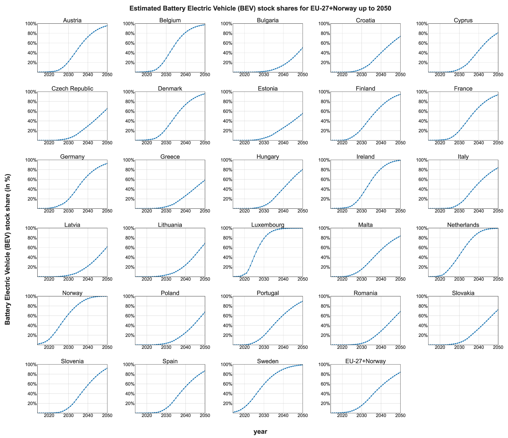

# 🚗 European passenger car stock model

The model allows to project the future European passenger car fleet composition by powertrain up to 2050.

## Table of Contents
- [About](#-about)
- [Statement of need](#-statement-of-need)
- [Recommended skills](#-recommended-skills)
- [Installation](#-installation)
- [Acknowledgements](#-acknowledgements)
- [Authorship](#-authorship)
- [License](#-license)
- [Contacts](#%EF%B8%8F-contacts)
- [How to Build](#-how-to-build)
- [Documentation](#-documentation)
- [Feedback and Contributions](#-feedback-and-contributions)

## 🔋 About

This repository presents a European passenger car stock model. It is based on the EU clustering model presented in [(Möring-Martínez et al., 2024)](https://doi.org/10.1016/j.trd.2024.104372) and in the empirical survivality rates approach presented in [(Held et al., 2021)](https://doi.org/10.1186/s12544-020-00464-0). This code is used to analyze the European BEV stock fleet up to 2050 in the publication: (Möring-Martínez et al., 2025 - under review).

<div align="center">
  
  <p style="margin-top: 0;"><b>Figure 1:</b> Estimated BEV stock shares for EU-27+Norway up to 2050 using [(Möring-Martínez et al., 2024)](https://doi.org/10.1016/j.trd.2024.104372) and 2021 country-specific empirical survival rates .</p>
</div>

## 📜 Statement of need

The European Passenger Car Stock Model is a model designed to project the composition of the passenger car fleet by powertrain type up to the year 2050 or later if desired, using the projection of new vehicle registrations and empirical survival rates as inputs. Built on country-specific data from 2021, the model enables researchers and policymakers to project future fleet compositions under varying new vehicle registration scenarios and/or varying empirical survival rates.

**Core features**

- **Scenario Exploration:**
Users can provide as input different new vehicle registration secenarios or modify the survival rates. Different new vehicle registration scenarios can have:
  - Technology advancements
  - Current and progressive policy implementations
  - Changes in energy prices

  Different survival rates can define:
  - Restrictions on vehicle drivability after a certain age based on survival rates.
  - Dynamic survival rates analyzing the effect of slower or faster stock turnover rates.

- **Survival Rate Analysis:**
The model incorporates historical survival rates from 2008, 2016, and 2021, allowing for detailed exploration of how changing lifespans influence fleet dynamics. Alternatively, assumptions about using other countries' survival rates can be used also to assess the impact.

**Contribution to the state of the art**

Unlike most existing tools in the field, which are proprietary, the European Passenger Car Stock Model is an open-source contribution, enabling transparency and accessibility. It offers the flexibility to integrate external transportation models, such as those described by [(Domarchi and Cherchi, 2023)](https://doi.org/10.1080/01441647.2023.2195687), to enhance the accuracy and applicability of fleet projections.

**Explorative, not prescriptive**


The model does not optimize fleet composition but instead explores the effects of different assumptions and scenarios. This allows users to study the emerging impacts of policy, technology, and economic changes on the European passenger car market.

In doing so, the model serves as a valuable tool for decision-making, enabling stakeholders to anticipate and plan for the future of passenger transportation systems across Europe.

## 🔧 Recommended skills

The European Passenger Car Stock Model is implemented in Python. While no programming skills are strictly required to configure and run the model, experience with transportation modeling and Python is beneficial. Developers wishing to modify the model's functionality or enhance its capabilities should have at least a basic understanding of Python.

## 📦 Installation

In order to run the model, proceed with the following steps:

1. Clone the project in the folder you want to store it
```
git clone https://gitlab.dlr.de/fk-tbs/personal-subgroups/gabriel-moring-martinez/eu-stock-model-paper.git
```
2. Change your working directory  to the folder where the repository was cloned
```
cd eu-stock-model-paper
```
3. Create a virtual environment
```
python -m venv venv
```
4. Activate the virtual environment.

- On Windows (Only tested on Windows)
```
venv\Scripts\activate
```
- On macOS/Linux:
```
venv\Scripts\activate
```
5. Install dependencies (libraries):
```
pip install -r stock_model_requirements.txt
```

## 🤝 Acknowledgements

Development of the European passenger car stock model was funded by the NDC ASPECTS project. It received funding from the European Union’s Horizon 2020 research and innovation programme under grant agreement No 101003866.  Additional funding for this research was provided by the MoDa project of the German Aerospace Center (DLR). We express our gratitude to all contributors.

## ✍️ Authorship

This model is developed by [Gabriel Möring-Martínez](https://orcid.org/0009-0003-4380-3081) in the DLR's Institute of Vehicle concepts. Special thanks to the DLR members [Stephan Schmid](https://orcid.org/0000-0002-3081-8749), [Isheeka Dasgupta](https://www.linkedin.com/in/isheeka644/), [Murat Senzeybek](https://orcid.org/0000-0003-1769-3539) and [Samuel Hasselwander](https://orcid.org/0000-0002-0805-9061) which helped in the model conceptualization.

## 📃 License

WRITE HERE SOMETHING

For non-commercial use, this product is available for free.

## 🗨️ Contacts

For any general information, further questions or future collaborations regarding the European passenger car stock model, feel free to reach out to us. We are here to provide support and answer any questions you may have. Below are the best ways to contact our team:

- **Email**: Send us your inquiries, proposals or support requests to [gabriel.moeringmartinez@dlr.de](mailto:gabriel.moeringmartinez@dlr.de).
- **Website**: Visit the official DLR-FK website for more information about the DLR-FK institute projects and publications: [DLR-FK (Institute of Vehicle Concepts)](https://www.dlr.de/en/fk).

For having the latest news about the DLR Institute of Vehicle Concepts, subscribe to our LinkedIn:

[![LinkedIn](https://img.shields.io/badge/subscribe-white.svg?logo=data:image/svg%2bxml;base64,PHN2ZyB2aWV3Qm94PSIwIDAgMjQgMjQiIHhtbG5zPSJodHRwOi8vd3d3LnczLm9yZy8yMDAwL3N2ZyI+PHBhdGggZD0iTTIwLjQ0NyAyMC40NTJoLTMuNTU0di01LjU2OWMwLTEuMzI4LS4wMjctMy4wMzctMS44NTItMy4wMzctMS44NTMgMC0yLjEzNiAxLjQ0NS0yLjEzNiAyLjkzOXY1LjY2N0g5LjM1MVY5aDMuNDE0djEuNTYxaC4wNDZjLjQ3Ny0uOSAxLjYzNy0xLjg1IDMuMzctMS44NSAzLjYwMSAwIDQuMjY3IDIuMzcgNC4yNjcgNS40NTV2Ni4yODZ6TTUuMzM3IDcuNDMzYTIuMDYyIDIuMDYyIDAgMCAxLTIuMDYzLTIuMDY1IDIuMDY0IDIuMDY0IDAgMSAxIDIuMDYzIDIuMDY1em0xLjc4MiAxMy4wMTlIMy41NTVWOWgzLjU2NHYxMS40NTJ6TTIyLjIyNSAwSDEuNzcxQy43OTIgMCAwIC43NzQgMCAxLjcyOXYyMC41NDJDMCAyMy4yMjcuNzkyIDI0IDEuNzcxIDI0aDIwLjQ1MUMyMy4yIDI0IDI0IDIzLjIyNyAyNCAyMi4yNzFWMS43MjlDMjQgLjc3NCAyMy4yIDAgMjIuMjIyIDBoLjAwM3oiIGZpbGw9IiMwQTY2QzIiLz48cGF0aCBzdHlsZT0iZmlsbDojZmZmO3N0cm9rZS13aWR0aDouMDIwOTI0MSIgZD0iTTQuOTE3IDcuMzc3YTIuMDUyIDIuMDUyIDAgMCAxLS4yNC0zLjk0OWMxLjEyNS0uMzg0IDIuMzM5LjI3NCAyLjY1IDEuNDM3LjA2OC4yNS4wNjguNzY3LjAwMSAxLjAxYTIuMDg5IDIuMDg5IDAgMCAxLTEuNjIgMS41MSAyLjMzNCAyLjMzNCAwIDAgMS0uNzktLjAwOHoiLz48cGF0aCBzdHlsZT0iZmlsbDojZmZmO3N0cm9rZS13aWR0aDouMDIwOTI0MSIgZD0iTTQuOTE3IDcuMzc3YTIuMDU2IDIuMDU2IDAgMCAxLTEuNTItMi42NyAyLjA0NyAyLjA0NyAwIDAgMSAzLjQxOS0uNzU2Yy4yNC4yNTQuNDIuNTczLjUxMi45MDguMDY1LjI0LjA2NS43OCAwIDEuMDItLjA1MS4xODYtLjE5Ny41MDQtLjMuNjUyLS4wOS4xMzItLjMxLjM2Mi0uNDQzLjQ2NC0uNDYzLjM1Ny0xLjEuNTAzLTEuNjY4LjM4MlpNMy41NTcgMTQuNzJWOS4wMDhoMy41NTd2MTEuNDI0SDMuNTU3Wk05LjM1MyAxNC43MlY5LjAwOGgzLjQxMXYuNzg1YzAgLjYxNC4wMDUuNzg0LjAyNi43ODMuMDE0IDAgLjA3LS4wNzMuMTI0LS4xNjIuNTI0LS44NjUgMS41MDgtMS40NzggMi42NS0xLjY1LjI3NS0uMDQyIDEtLjA0NyAxLjMzMi0uMDA5Ljc5LjA5IDEuNDUxLjMxNiAxLjk0LjY2NC4yMi4xNTcuNTU3LjQ5My43MTQuNzEzLjQyLjU5Mi42OSAxLjQxMi44MDggMi40NjQuMDc0LjY2My4wODQgMS4yMTUuMDg1IDQuNTc4djMuMjU4aC0zLjUzNnYtMi45ODZjMC0yLjk3LS4wMS0zLjQ3NC0uMDc0LTMuOTA4LS4wOS0uNjA2LS4zMTQtMS4wODItLjYzNC0xLjM0Mi0uMzk1LS4zMjItMS4wMjktLjQzNy0xLjcwMy0uMzA5LS44NTguMTYzLTEuMzU1Ljc1LTEuNTIzIDEuNzk3LS4wNzYuNDcxLS4wODQuODQ1LS4wODQgMy44MzR2Mi45MTRIOS4zNTN6Ii8+PC9zdmc+)](https://www.linkedin.com/showcase/dlr-institut-fuer-fahrzeugkonzepte/posts/?feedView=all)

[Back to top](#top)

## Test and Deploy

Use the built-in continuous integration in GitLab.

- [ ] [Get started with GitLab CI/CD](https://docs.gitlab.com/ee/ci/quick_start/index.html)
- [ ] [Analyze your code for known vulnerabilities with Static Application Security Testing (SAST)](https://docs.gitlab.com/ee/user/application_security/sast/)
- [ ] [Deploy to Kubernetes, Amazon EC2, or Amazon ECS using Auto Deploy](https://docs.gitlab.com/ee/topics/autodevops/requirements.html)
- [ ] [Use pull-based deployments for improved Kubernetes management](https://docs.gitlab.com/ee/user/clusters/agent/)
- [ ] [Set up protected environments](https://docs.gitlab.com/ee/ci/environments/protected_environments.html)

***

# Editing this README

When you're ready to make this README your own, just edit this file and use the handy template below (or feel free to structure it however you want - this is just a starting point!). Thanks to [makeareadme.com](https://www.makeareadme.com/) for this template.

## Suggestions for a good README

Every project is different, so consider which of these sections apply to yours. The sections used in the template are suggestions for most open source projects. Also keep in mind that while a README can be too long and detailed, too long is better than too short. If you think your README is too long, consider utilizing another form of documentation rather than cutting out information.

## Name
Choose a self-explaining name for your project.

## Description
Let people know what your project can do specifically. Provide context and add a link to any reference visitors might be unfamiliar with. A list of Features or a Background subsection can also be added here. If there are alternatives to your project, this is a good place to list differentiating factors.

## Badges
On some READMEs, you may see small images that convey metadata, such as whether or not all the tests are passing for the project. You can use Shields to add some to your README. Many services also have instructions for adding a badge.

## Visuals
Depending on what you are making, it can be a good idea to include screenshots or even a video (you'll frequently see GIFs rather than actual videos). Tools like ttygif can help, but check out Asciinema for a more sophisticated method.

## Installation
Within a particular ecosystem, there may be a common way of installing things, such as using Yarn, NuGet, or Homebrew. However, consider the possibility that whoever is reading your README is a novice and would like more guidance. Listing specific steps helps remove ambiguity and gets people to using your project as quickly as possible. If it only runs in a specific context like a particular programming language version or operating system or has dependencies that have to be installed manually, also add a Requirements subsection.

## Usage
Use examples liberally, and show the expected output if you can. It's helpful to have inline the smallest example of usage that you can demonstrate, while providing links to more sophisticated examples if they are too long to reasonably include in the README.

## Support
Tell people where they can go to for help. It can be any combination of an issue tracker, a chat room, an email address, etc.

## Roadmap
If you have ideas for releases in the future, it is a good idea to list them in the README.

## Contributing
State if you are open to contributions and what your requirements are for accepting them.

For people who want to make changes to your project, it's helpful to have some documentation on how to get started. Perhaps there is a script that they should run or some environment variables that they need to set. Make these steps explicit. These instructions could also be useful to your future self.

You can also document commands to lint the code or run tests. These steps help to ensure high code quality and reduce the likelihood that the changes inadvertently break something. Having instructions for running tests is especially helpful if it requires external setup, such as starting a Selenium server for testing in a browser.

## Authors and acknowledgment
Show your appreciation to those who have contributed to the project.

## License
For open source projects, say how it is licensed.
