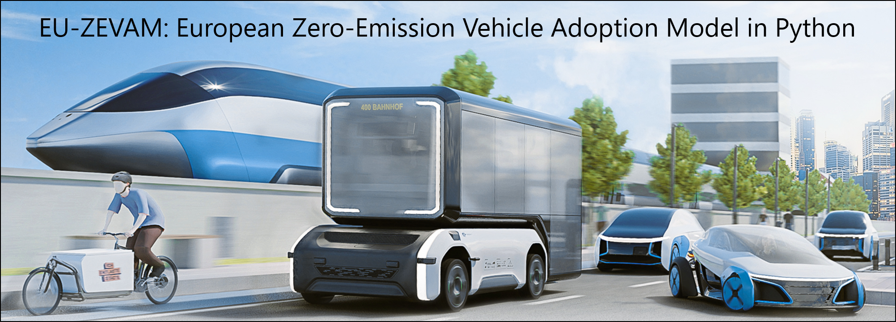
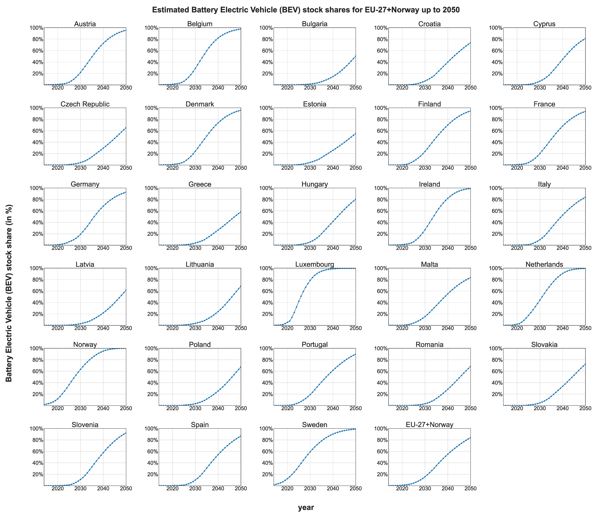

<!--
SPDX-FileCopyrightText: 2025 German Aerospace Center, Gabriel Möring-Martínez

SPDX-License-Identifier: CC-BY-4.0
-->



[](https://api.reuse.software/info/github.com/gabrielmoringmartinez/European-passenger-car-stock-model)
[](LICENSES/MIT.txt)
[](LICENSES/CC-BY-SA-4.0.txt)
[](https://github.com/gabrielmoringmartinez/European-passenger-car-stock-model/actions/workflows/test.yml)
[](https://codecov.io/github/gabrielmoringmartinez/European-passenger-car-stock-model)


<a href="https://github.com/gabrielmoringmartinez/European-passenger-car-stock-model">
  
</a>

# 🚗 ZEVAMPY: European Zero-Emission Vehicle Adoption Model in Python
**A flexible Python framework for vehicle stock modelling, fleet survival analysis, and zero-emission vehicle adoption projections**

**ZEVAMPY estimates future vehicle fleet composition by powertrain using empirical survival rates and vehicle registration scenarios.**


## Table of Contents
- [About](#-about)
- [Statement of need](#-statement-of-need)
- [Recommended skills](#-recommended-skills)
- [Installation](#-installation)
- [Testing](#-testing)
- [Acknowledgements](#-acknowledgements)
- [Authorship](#-authorship)
- [Citation](#-citation)
- [License](#-license)
- [Contacts](#%EF%B8%8F-contacts)

## 🔋 About

ZEVAMPY is an open-source Python framework for modelling vehicle fleet evolution using empirical survival rates and new vehicle registration scenarios. The framework estimates cumulative survival probability (CSP) curves, calculates vehicle stock by powertrain, and projects future fleet composition over user-defined time horizons.

Although ZEVAMPY was originally developed and validated for European passenger-car fleets, it is designed to be reusable for other countries, powertrain categories, and projection periods when suitable stock and registration data are available. Survival rates can be estimated at different aggregation levels, including country-level, powertrain-level, or combined country–powertrain groupings.

The repository includes a default European passenger-car application based on country-specific survival rates and registration scenarios for EU-27 countries and Norway. The methodological foundations draw on the transport-demand modelling framework presented in [Möring-Martínez et al., 2024](https://doi.org/10.1016/j.trd.2024.104372) and on the empirical survival-rate methodology described in [Held et al., 2021](https://doi.org/10.1186/s12544-020-00464-0). The framework has been applied to analyse future BEV fleet evolution in Europe in [Möring-Martínez et al., 2025](https://doi.org/10.1016/j.trd.2025.104945).

<div align="center">
  
  <p style="margin-top: 0;"><b>Figure 1:</b> Example output from ZEVAMPY showing projected BEV stock shares for EU-27 countries and Norway up to 2050 using country-specific empirical survival rates.</p>
</div>

## 📜 Statement of need

Vehicle fleet models are used to explore how passenger-car fleets evolve under different technology, policy, and market assumptions. However, many existing tools are difficult to reproduce, not openly available, or tightly coupled to a specific dataset or case study.

ZEVAMPY addresses this gap by providing a reusable and modular Python framework for vehicle stock modelling. It separates the modelling workflow into transparent components for data loading, survival-rate estimation, CSP fitting, stock calculation, validation, plotting, and sensitivity analysis. This structure allows users to adapt the framework to different countries, powertrain classifications, vehicle categories, and time horizons.


**Core features**

- **Flexible stock projections:**  
  Users can project vehicle fleet composition by powertrain using custom registration scenarios and user-defined projection periods.

- **Empirical survival-rate estimation:**  
  Survival rates can be estimated from stock and registration data at different years and aggregation levels, including country-level, powertrain-level, or combined country–powertrain groupings.

- **CSP fitting and stock modelling:**  
  The framework fits cumulative survival probability curves and combines them with new registration data to estimate future vehicle stock.

- **Reusable and extensible design:**  
  The model can be coupled with external transportation models or scenario datasets, enabling applications beyond the default European passenger-car case.

- **Research-oriented analysis workflows:**  
  The repository includes example workflows for validation, sensitivity analysis, and comparative scenario exploration based on alternative survival-rate and registration assumptions.

**Contribution to the state of the art**

Unlike many fleet-modelling tools, ZEVAMPY is open source, modular, and designed for reuse. It enables transparent analysis of how vehicle registrations and survival rates influence future fleet composition. While the default application focuses on European battery-electric passenger cars, the framework can be adapted to other regions, powertrain groups, and modelling horizons when the required input data are available.

**Explorative, not prescriptive**

ZEVAMPY does not optimize fleet composition. Instead, it helps users explore how different assumptions about vehicle registrations and fleet turnover affect future stock shares. This makes it useful for researchers, policymakers, and analysts who want to assess long-term fleet dynamics under alternative scenarios.

## 🔧 Recommended skills

The European Passenger Car Stock Model is implemented in Python. While no programming skills are strictly required to configure and run the model, experience with transportation modeling and Python is beneficial. Developers wishing to modify the model's functionality or enhance its capabilities should have at least a basic understanding of Python.

## 📦 Installation

ZEVAMPY can be installed in two ways:

1. **As a user**: install the released package from PyPI.
2. **As a developer**: clone the repository and install it in editable mode.

### Requirements

ZEVAMPY requires:

- Python 3.12 or later
- `pip`
- input datasets in CSV format
- a YAML configuration file defining model settings and file paths

The package has been developed and tested primarily on Windows 10/11 using WSL2 Ubuntu. It should also work on Linux and macOS, but these systems have not yet been fully tested.

---

### What users need
To run ZEVAMPY, users provide a set of CSV input files together with a YAML configuration file describing the modelling setup.
#### Required input datasets
At the current stage, ZEVAMPY expects the following filenames inside the folder defined by `data.input_path` in `config.yaml`. The folder path can be modified, but the filenames are currently fixed.
##### Country clusters (optional)
- `inputs/0_country_clusters.csv`: 

Defines optional country clusters used to reduce the number of independent registration forecasts required. Countries assigned to the same cluster are assumed to share the same projected powertrain registration shares.

This file is optional and can be disabled in `config.yaml` by setting:

```yaml
geography:
  use_clusters: false
```

---

##### Historical and projected vehicle registrations by powertrain

- `inputs/1_1_new_registrations_by_fuel_type_clusters.csv`

Contains historical and projected vehicle-registration shares by powertrain for the defined countries or clusters.

---

##### Historical total vehicle registrations

- `inputs/1_2_A_2_historical_new_registrations_data_passenger_cars.csv`

Contains historical absolute vehicle-registration numbers by country up to the latest available historical year.

---
##### Projected total vehicle registrations

- `inputs/1_3_new_registrations_projected.csv`

Contains projected total vehicle-registrations for future years up to the selected simulation horizon.

---

##### Stock-by-age datasets

- `inputs/2_1_A_1_age_resolved_data_passenger_car_stock_fleet.csv`

Contains the vehicle stock resolved by vehicle age. This dataset is used to estimate empirical cumulative survival probability (CSP) curves.

The dataset can optionally include additional dimensions such as:
- `geo country`
- `powertrain`

This allows empirical survival rates to be estimated at different aggregation levels.

Meaningful survival-rate estimation and subsequent stock projections require sufficiently high goodness-of-fit values for the fitted CSP curves (e.g., high R² values in `outputs/2_1_optimum_parameters_csp_curves.csv`).

---

##### CSP reference year

- `inputs/2_2_A_1_stock_year.csv`

Defines the reference year associated with the stock-by-age dataset used for CSP estimation.

For example, the configuration file `config.yaml` may define:
```yaml
csp_reference_year: 2021
```
However, some countries may only provide stock-by-age data for neighbouring years such as 2020 or 2022. This file specifies the actual stock-reference year used for each country or dataset during CSP estimation.

---

##### Optional validation and sensitivity-analysis datasets
Files in the default inputs beginning with:
- `4_*`
- `5_*`

are optional and mainly used for:
- historical validation,
- sensitivity analysis,
- and reproduction of the default European case study.

These files are not required for running custom ZEVAMPY applications.

---

### Configuration file
- `config.yaml`

The configuration file acts as the main user interface of ZEVAMPY and controls the complete modelling workflow. It defines:
- input and output paths
- countries or regions
  - If `countries` is left empty, all available countries found in the input datasets are used.
- powertrains
  - If `powertrains` is left empty, all available powertrain categories found in the input datasets are used.
- projection horizon
- Cumulative Survival Probability (CSP) settings
- validation settings
- and optional sensitivity-analysis options.

A complete example configuration file is provided with the default ZEVAMPY example dataset.

### Installation for users

Use this option if you want to run ZEVAMPY without modifying the source code.

#### 1. Create and activate a virtual environment

```bash
python -m venv venv
```
On Windows PowerShell:
```powershell
venv\Scripts\Activate.ps1
```
On Linux/macOS/WSL:
```bash
source venv/bin/activate
```
#### 2. Install ZEVAMPY from PyPI
```bash
pip install zevampy
```
#### 3. Prepare your input folder
Create a project folder containing:
```bash
my_zevampy_project/
├── config.yaml
├── inputs/
└── outputs/
```
The `inputs` folder should contain the required CSV input files.
#### 4. Configure the model
Edit `config.yaml` to define the model setup, for example:
```yaml
data:
  input_path: inputs
  output_path: outputs
  
geography:
  countries:
    - Germany
    - France
  use_clusters: true

powertrains:
  - BEV
  - Gasoline
  - Diesel

model:
  start_new_registration_year: 1970
  first_stock_year: 2014
  end_year: 2050
  csp_reference_year: 2021
  csp_available_years: 45
  historical_validation: true
  historical_csp: true
  sensitivity_analysis: false

survival_rates:
  grouping:
    - geo country
```
To estimate survival rates by both country and powertrain, use:
```yaml
survival_rates:
  grouping:
    - geo country
    - powertrain
```
This requires stock-by-age input data that also contains a `powertrain` column.

#### 5. Run ZEVAMPY
```bash
zevampy --config config.yaml
```
Alternatively:
```bash
python -m zevampy.cli --config config.yaml
```
---
### Installation for developers
Use this option if you want to modify the codebase or contribute to ZEVAMPY.
#### 1. Clone the repository
```bash
git clone https://github.com/gabrielmoringmartinez/zevampy.git
cd zevampy
```
#### 2. Create and activate a virtual environment
```bash
python -m venv venv
```
On Windows PowerShell:
```bash
venv\Scripts\Activate.ps1
```
On Linux/macOS/WSL:
```bash
source venv/bin/activate
```
#### 3. Install the package in editable mode
```bash
pip install -e .
```
If you keep a separate requirements file for development tools, install it as well:
```bash
pip install -r stock_model_requirements.txt
```
#### 4. Run the model locally
```bash
zevampy --config config.yaml
```
or:
```bash
python -m zevampy.cli --config config.yaml
```
---
### Adapting ZEVAMPY to new use cases

ZEVAMPY separates model logic from input datasets and configuration settings, allowing users to adapt the framework to new applications without modifying the core source code.

ZEVAMPY is designed to be reusable beyond the default European passenger-car case.

Users can adapt:
- Countries or regions by changing the geography.countries section in config.yaml
- Powertrains by changing the powertrains list
- Projection horizon by changing model.end_year
- Input and output folders through the data section
- Survival-rate grouping through survival_rates.grouping

For example, to model country- and powertrain-specific survival rates:
```yaml
survival_rates:
  grouping:
    - geo country
    - powertrain
```
The input stock-by-age file must then include at least:
```text
geo country;vehicle age;powertrain;number of registered vehicles
```
For country-level survival rates only, the stock-by-age input file should include:
```text
geo country;vehicle age;number of registered vehicles
```
This makes it possible to extend ZEVAMPY to additional countries, powertrain categories, vehicle classes, or projection horizons when suitable input data are available.

## 🧪 Testing
[](https://github.com/gabrielmoringmartinez/European-passenger-car-stock-model/actions/workflows/test.yml)
[](https://codecov.io/github/gabrielmoringmartinez/European-passenger-car-stock-model)

This repository includes unit tests to ensure consistent and reliable behavior of the European passenger car stock model.

To run all automated tests:

```bash
python run_tests.py
```
This will:

- Discover and execute all tests in the tests/folder using pytest

- Print outputs to the terminal (due to the -s flag in use) and save outputs in the outputs folder

- Exit with a status code indicating test success or failure

### Optional: Run a specific test

To run an individual test instead, modify the run_tests.py script. For example:
```
# Uncomment and adapt one of the lines below in run_tests.py

# Syntax:
# sys.exit(pytest.main(["tests/test_file.py::test_function"]))

# Example:
# sys.exit(pytest.main(["tests/test_4_model_runs_on_minimal_input_single_country.py::test_model_runs_on_minimal_input"]))
```
**Note:** The tests assume the model environment is already set up. The tests assume the model environment is already set up. Make sure you’ve installed the required dependencies with:
```bash
pip install -r stock_model_requirements.txt.
```
## 🤝 Acknowledgements

Development of the European passenger car stock model was funded by the NDC ASPECTS project. It received funding from the European Union’s Horizon 2020 research and innovation programme under grant agreement No 101003866.  Additional funding for this research was provided by the MoDa project of the German Aerospace Center (DLR). We express our gratitude to all contributors.

## ✍️ Authorship

This model is developed by [Gabriel Möring-Martínez](https://orcid.org/0009-0003-4380-3081) in the DLR's Institute of Vehicle concepts. Special thanks to the DLR members [Stephan Schmid](https://orcid.org/0000-0002-3081-8749), [Isheeka Dasgupta](https://www.linkedin.com/in/isheeka644/), [Murat Senzeybek](https://orcid.org/0000-0003-1769-3539) and [Samuel Hasselwander](https://orcid.org/0000-0002-0805-9061) which helped in the model conceptualization.

## 📝 Citation


For work involving the EU-ZEVAM model in your work, please cite the following:

Möring-Martínez, G. (2025). "EU-ZEVAM: European Zero-Emission Vehicle Adoption Model in Python." *Journal of Open Source Software*, XX(XXX), XXXX. [doi:XX.XXXXX/joss.XXXXX](doi:XX.XXXXX/joss.XXXXX), [https://doi:XX.XXXXX/joss.XXXXX](https://doi:XX.XXXXX/joss.XXXXX)
```bibtex
@article{MoringMartinez2025EUZEVAM,
  author = {M{\"o}ring-Martínez, Gabriel},
  title = {{EU-ZEVAM}: {European} zero-emission vehicle adoption model in {Python}},
  year = {2025},
  doi = {10.21105/joss.XXXXX},
  url = {https://doi.org/XX.XXXXX/joss.XXXXX},
  journal = {Journal of Open Source Software},
  volume = {X},
  number = {X},
  pages = {X},
  publisher = {The Open Journal}
}
```
Möring-Martínez, G., Senzeybek, M., Hasselwander, S., Schmid, S. (2025).  "Quantifying the impact of fleet turnover on electric vehicle uptake in Europe."  *Transportation Research Part D: Transport and Environment*, **XXX**, XXXXXX. [https://doi.org/10.1016/j.trd.2025.XXXXXX](doi.org/10.1016/j.trd.2025.XXXXXX), [https://doi.org/10.1016/j.trd.2025.XXXXXX](https://doi.org/10.1016/j.trd.2025.XXXXXX)

```bibtex
@article{MoringMartinez2025Paper,
   author={M{\"o}ring-Martínez, Gabriel and Senzeybek, Murat and Hasselwander, Samuel and Schmid, Stephan},
   title={Quantifying the impact of fleet turnover on electric vehicle uptake in Europe},
   journal={Transportation Research Part D: Transport and Environment},
   volume={X},
   number={X},
   year={2025},
   URL={https://doi.org/XX.XXXX/XXXXXX},
   doi={XX.XXXX/XXXXXXXXX},
   publisher={Elsevier}
}

```

You can also find machine-readable citation metadata for the EU-ZEVAM Python model in the [CITATION.cff](./CITATION.cff) file for use with citation tools like GitHub’s citation button or Zotero.

## 📃 License

[](https://api.reuse.software/info/github.com/gabrielmoringmartinez/European-passenger-car-stock-model)
[](LICENSES/MIT.txt)
[](LICENSES/CC-BY-SA-4.0.txt)


This project is REUSE compliant and licensed under multiple open licenses depending on content type:

- **Source Code**: [MIT License](LICENSES/MIT.txt)  
- **Datasets**: [CC BY-SA 4.0](LICENSES/CC-BY-SA-4.0.txt)
- **Documentation and Plots**: [CC BY 4.0](LICENSES/CC-BY-4.0.txt)  
- **Minor Assets**: [CC0-1.0](LICENSES/CC0-1.0.txt)

Some third-party data is excluded (see details below).

For full licensing details and exceptions, see the [LICENSE.md](./LICENSE.md) file.

## 🗨️ Contacts

For any general information, further questions or future collaborations regarding the European passenger car stock model, feel free to reach out to us. We are here to provide support and answer any questions you may have. Below are the best ways to contact our team:

- **Email**: Send us your inquiries, proposals or support requests to [gabriel.moeringmartinez@dlr.de](mailto:gabriel.moeringmartinez@dlr.de).
- **Website**: Visit the official DLR-FK website for more information about the DLR-FK institute projects and publications: [DLR-FK (Institute of Vehicle Concepts)](https://www.dlr.de/en/fk).

For having the latest news about the DLR Institute of Vehicle Concepts, subscribe to our LinkedIn:

[![LinkedIn](https://img.shields.io/badge/subscribe-white.svg?logo=)](https://www.linkedin.com/showcase/dlr-institut-fuer-fahrzeugkonzepte/posts/?feedView=all)

[Back to top](#top)
