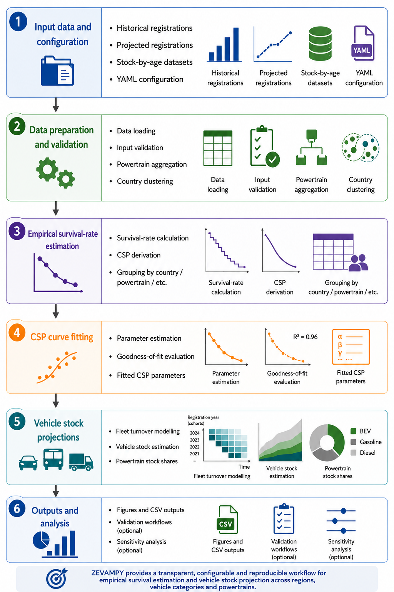

# Summary

Vehicle stock turnover models are widely used to analyze the long-term evolution of vehicle fleets under different technological, economic, and policy assumptions [@jochem2018methods]. These models support applications such as estimating future energy and infrastructure demand, evaluating decarbonization pathways, and assessing zero-emission vehicle adoption [@Ellingsen.2016; @GomezVilchez.2020]. ZEVAMPY (Zero-Emission Vehicle Adoption Model in Python) is an open-source Python framework for modelling vehicle stock evolution using empirical survival rates and vehicle registration scenarios. The framework estimates cumulative survival probability (CSP) curves from stock-by-age datasets and combines them with historical or projected vehicle registrations to estimate future vehicle stock composition by powertrain. The model supports configurable aggregation levels, including country-level, powertrain-level, and combined country–powertrain survival-rate estimation, enabling analyses at different levels of technological and geographic detail. ZEVAMPY allows users to analyze how vehicle-registration scenarios and empirically estimated fleet turnover dynamics influence long-term vehicle stock composition. The framework supports applications across different geographic regions, vehicle categories, and powertrain classifications, including passenger cars, buses, and trucks. The software additionally includes workflows for validation, sensitivity analysis, and comparative scenario exploration within the default European passenger-car application. Although ZEVAMPY includes a default application for European passenger-car fleet modelling, the framework is designed to support broader vehicle stock modelling applications when suitable stock and registration data are available.

# Statement of need

Numerous vehicle adoption and fleet-transition models have been developed differing in geographic scope, modelling assumptions, explanatory variables, and data sources [@Kumar.2020;@Maybury.2022]. These models are widely used to analyse transportation decarbonization pathways, future energy demand, and the diffusion of alternative vehicle technologies. However, many existing modelling approaches remain difficult to reproduce, are not openly available, or are tightly coupled to specific datasets and case-study assumptions, limiting their transparency, adaptability, and reuse across transportation-modelling applications [@jochem2018methods].

In addition, vehicle stock turnover dynamics are often represented using simplified or fixed vehicle survival assumptions, despite their strong influence on projected fleet composition and electrification rates [@Held.2021]. Estimating empirical cumulative survival probability (CSP) curves across different countries, vehicle categories, or powertrain groups typically requires substantial data processing and methodological harmonization, which can hinder reproducible and extensible transportation-modelling workflows.

ZEVAMPY addresses these limitations by providing an open-source Python framework for modelling vehicle fleet evolution using empirical survival-rate estimation and configurable registration scenarios. The framework separates modelling logic, configuration settings, and input datasets, enabling users to adapt workflows to different geographic regions, vehicle categories, powertrain classifications, and projection horizons without modifying the core model structure. ZEVAMPY additionally supports configurable aggregation levels for survival-rate estimation, including country-level, powertrain-level, and combined country–powertrain analyses.

The framework includes reusable workflows for cumulative survival probability (CSP) estimation, vehicle stock projection, validation, and sensitivity analysis. Although the default application focuses on European passenger-car fleet modelling, the software is designed to support broader transportation-modelling applications when suitable stock-by-age and vehicle-registration datasets are available. By providing an openly available and extensible implementation of empirical vehicle stock turnover modelling, ZEVAMPY contributes to improving transparency, reproducibility, and reuse in transportation-system analysis.

The ZEVAMPY model is fully developed in Python and is openly available on Github at <https://github.com/gabrielmoringmartinez/zevampy>.

# Modelling approach

ZEVAMPY is designed as a flexible and reusable framework for vehicle stock turnover and fleet-composition modelling using empirical survival rates and configurable vehicle-registration scenarios. Although the default application focuses on European passenger-car fleets, the framework is adaptable to different geographic regions, vehicle categories, and powertrain classifications when suitable stock-by-age and vehicle-registration datasets are available. The software supports modelling applications for passenger cars, buses, and trucks, at different levels of technological and geographic aggregation.

The framework is based on the main workflow components illustrated in  \autoref{figure1}. Starting from user-provided stock-by-age datasets, historical vehicle registrations, projected registration scenarios, and a YAML configuration file, ZEVAMPY performs data loading, validation, and preprocessing. The configuration system allows users to define modelling assumptions such as the projection horizon, selected countries or regions, powertrain classifications, aggregation levels for survival-rate estimation, and optional validation or sensitivity-analysis workflows. 

Following data preparation, the framework estimates empirical survival rates from stock-by-age and registrations datasets and derives cumulative survival probability (CSP) curves. Survival rates can be estimated at different aggregation levels, including country-level, powertrain-level, or combined country–powertrain groupings, depending on the structure and resolution of the available input data. The software additionally supports optional country clustering and configurable powertrain aggregation to simplify modelling workflows and improve adaptability to different datasets.

The estimated empirical CSP curves are subsequently fitted using parameterized survival functions to derive continuous representations of fleet turnover dynamics. The resulting fitted CSP curves are then combined with historical and projected vehicle-registration data within a cohort-based stock modelling framework to estimate future vehicle stock composition by powertrain and vehicle age over user-defined projection horizons.

The framework generates multiple modelling outputs, including estimated vehicle stock by powertrain and age, projected stock shares, fitted CSP parameters, empirical survival rates, and graphical outputs for comparative scenario analysis. The default European passenger-car application additionally includes reusable workflows for validation and sensitivity analysis using alternative historical survival-rate assumptions and vehicle-registration trajectories.

By separating modelling logic, configuration settings, and input datasets, ZEVAMPY enables transparent and reproducible vehicle stock turnover modelling while facilitating adaptation to new transportation-modelling applications and scenario analyses.

# Projects and publications

Earlier versions of the ZEVAMPY framework have already been applied in several transportation-modelling studies and ongoing research projects.

The framework was first applied to estimate future battery-electric vehicle (BEV) stock shares across EU-27 countries and Norway using country-specific empirical survival rates and projected vehicle-registration scenarios [@MoringMartinez.2025b]. This application analysed how fleet turnover dynamics influence long-term electrification pathways under alternative survival-rate assumptions.

The modelling workflow has additionally been adapted for a Germany-focused case study investigating future BEV fleet evolution under different battery chemistries and bidirectional-charging assumptions [@Hasselwander.2025]. In this application, the framework was coupled with alternative technology-specific vehicle-registration scenarios to analyse future stock composition and charging-related implications.

Current ongoing work further extends the framework toward powertrain-specific empirical survival-rate estimation using newly available stock-by-age datasets. This extension enables differentiated survival modelling across technologies such as battery-electric, plug-in hybrid, gasoline, and diesel vehicles. The approach is currently being demonstrated for a German case study and is intended to support future analyses of heterogeneous fleet-turnover dynamics across powertrain groups.

These applications demonstrate the flexibility of ZEVAMPY for analysing vehicle stock evolution across different geographic scopes, vehicle categories, technology assumptions, and transportation-modelling questions.

# Acknowledgements

Development of ZEVAMPY was supported through the NDC ASPECTS project, which received funding from the European Union’s Horizon 2020 Research and Innovation Programme under grant agreement No. 101003866. Additional support was provided through the MoDa project of the German Aerospace Center (DLR).

# References

